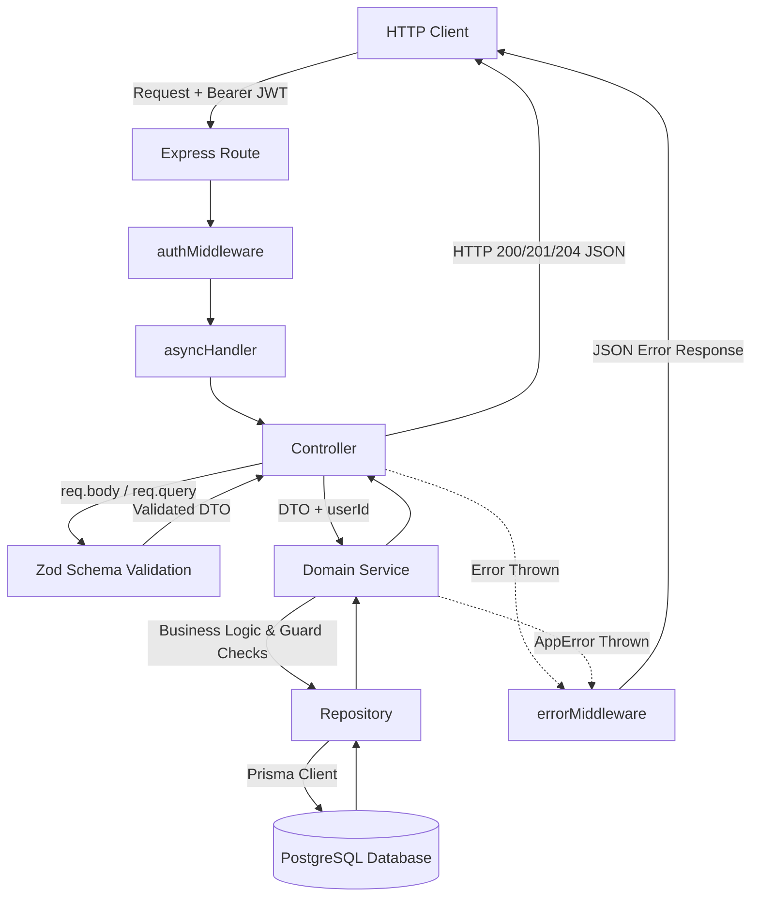
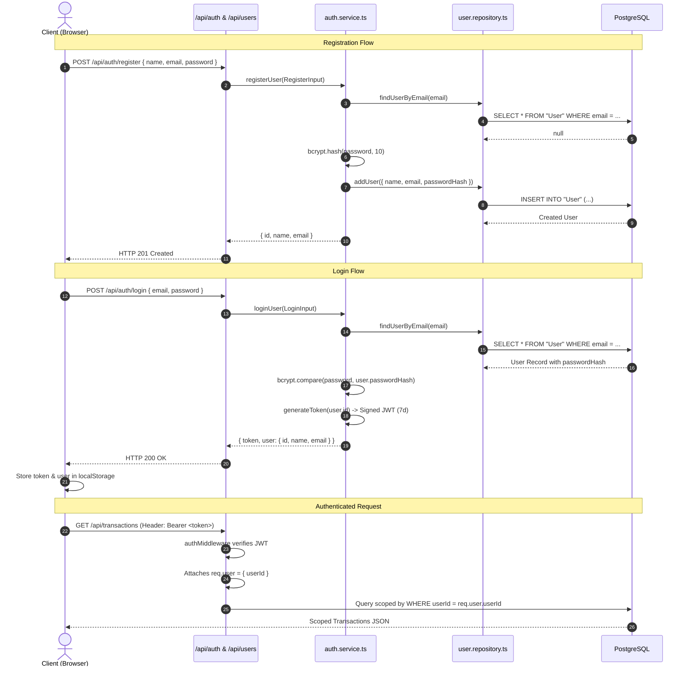
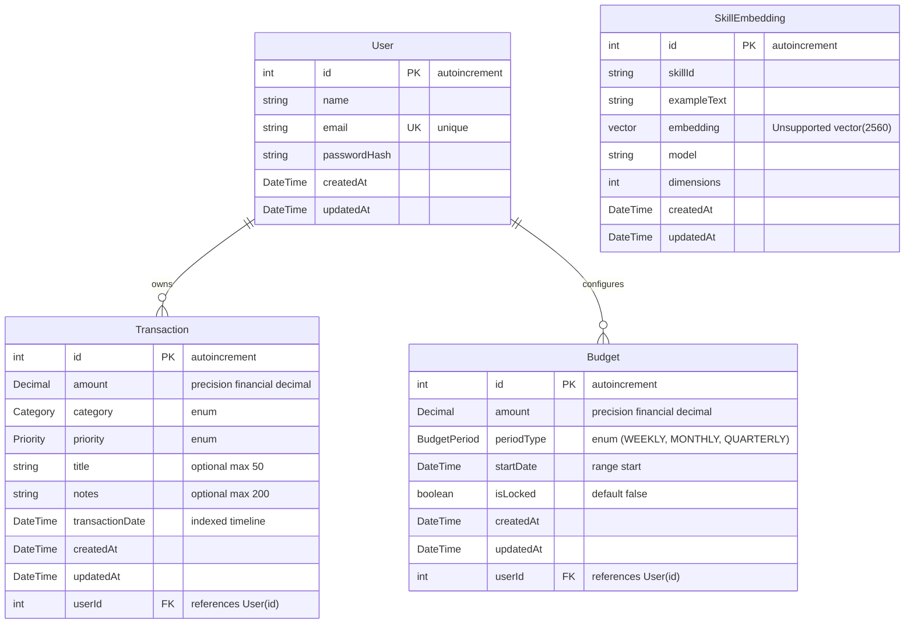
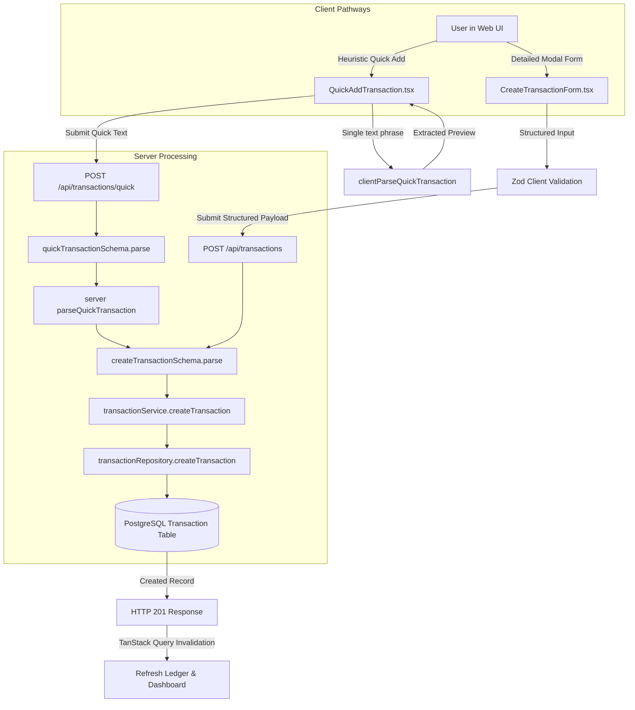
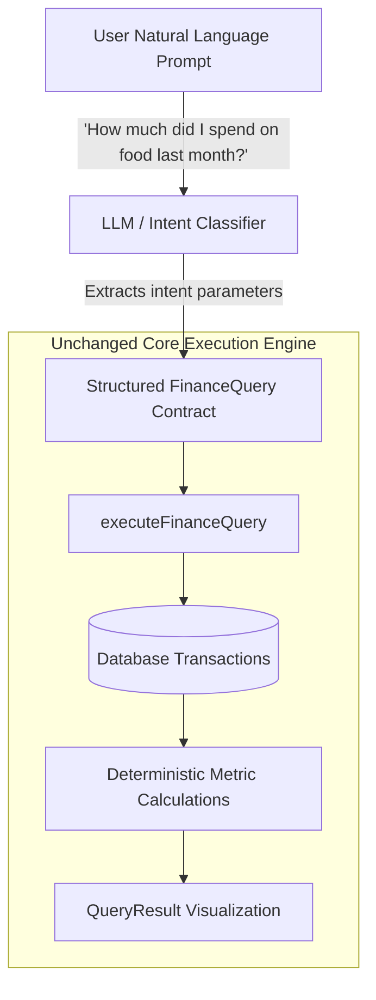
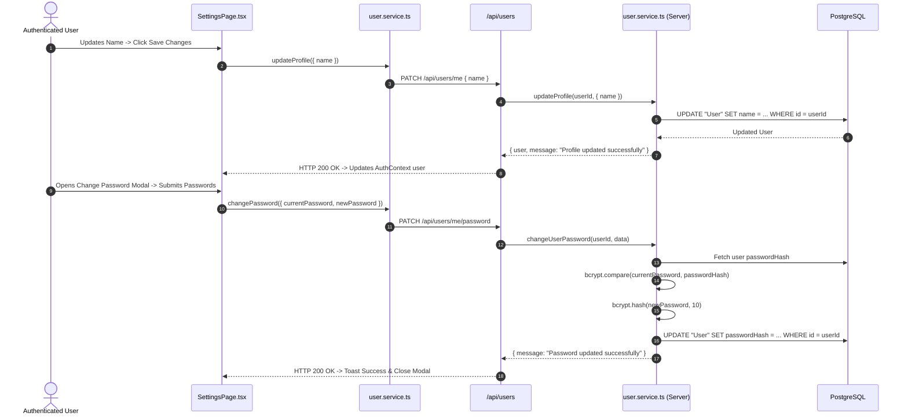

# Finance One — Project Architecture

> Living technical documentation of the current Finance One system.

**Status:** Living document  
**Last audited:** 2026-10-03  
**Repository:** Finance One  
**Primary stack:** Node.js (Express 5 + TypeScript), React 19 (Vite + Tailwind CSS v4 + TanStack Query v5), PostgreSQL (Prisma ORM 7), Vite PWA  

---

## 1. Executive Project Overview

Finance One is a personal financial management and transaction intelligence platform designed to give individuals complete visibility and control over their cash flow, budgets, and spending habits.

```text
Simple Reliable Foundations
        ↓
Fast Transaction Ingestion (Structured + Heuristic Quick Add)
        ↓
Structured Financial Data (Strict Postgres/Prisma Data Models)
        ↓
Deterministic Querying (Category & Timeframe Aggregations)
        ↓
High-Velocity User Experience (Zero-Friction Guided Explorer)
        ↓
Future Intelligence / AI (Natural-Language Intent Classification)
        ↓
Mobile-First PWA Experience (Installable Standalone Client)
```

### Problem Solved
Traditional budgeting tools suffer from two extremes:
1. **Cumbersome manual tracking** requiring endless dropdowns, date pickers, and confirmations.
2. **Black-box AI financial chatbots** that hallucinate numbers, misclassify categories, and lack deterministic reliability.

Finance One bridges this gap by combining **ultra-fast transaction entry**, **strict relational database schemas**, and a **deterministic query engine** that renders instant visual breakdowns without statistical guesswork.

### Current MVP Scope & Major Capabilities
- **Transaction Ledger**: Complete CRUD operations, real-time multi-dimensional filtering (category, priority, date range, min/max amount, text search), and sorting with server-side pagination.
- **Dual Ingestion Engine**:
  - *Detailed Form*: Validated modal supporting amount, category, priority, optional title, notes, and custom transaction dates.
  - *Quick Add (Heuristic Entry)*: Deterministic client/server natural-language heuristic parser translating phrases like `"450 lunch"` or `"₹350 uber yesterday"` into structured transaction inputs.
- **Budget Tracking & Enforcement**: Support for weekly, monthly, and quarterly budgets with overlap prevention, lock controls, and live utilization tracking.
- **Financial Dashboard**: KPI cards, budget hero cards with remaining balance and utilization bars, category donut and bar charts, priority distributions, and recent transaction summaries.
- **Query Explorer (Where did I spend?)**: Guided, gamified 2-step financial exploration tool. Selecting a category and timeframe instantly executes aggregations and displays metrics, charts, and follow-up filters.
- **Account & Security Management**: Authenticated user profile updates (name change) and secure password change with bcrypt verification.
- **PWA Ready**: Web app manifest, service worker generation via `vite-plugin-pwa` and Workbox, and standalone mobile display configuration.

### What Finance One Deliberately Does NOT Do Yet
- **Does NOT execute uncontrolled LLM SQL queries**: Financial numbers are calculated deterministically via Prisma aggregation and domain services, not generated by an LLM prompt.
- **Does NOT connect directly to live bank APIs or UPI callbacks**: Bank scraping (e.g., Plaid/Setu) and bank-side UPI webhook callbacks are not currently integrated.
- **Does NOT store transactions offline in IndexedDB yet**: Offline queuing and background synchronization are planned for future PWA phases.

---

## 2. Implementation Status Matrix

| Subsystem / Feature | Implementation Status | Location | Notes |
|---|---|---|---|
| User Authentication (Register/Login/JWT) | **EXISTS** | `apps/server/src/controllers/auth.controller.ts` | JWT in Authorization header, bcrypt hashing |
| User Profile & Password Update | **EXISTS** | `apps/server/src/controllers/user.controller.ts` | `/api/users/me` and `/api/users/me/password` |
| Transaction CRUD & Query API | **EXISTS** | `apps/server/src/routes/transation.routes.ts` | Complete filtering, sorting, pagination |
| Heuristic Transaction Parsing | **EXISTS** | `apps/server/src/utils/transactionParser.ts` | Regex/keyword deterministic parser |
| Budget Management & Overlap Guard | **EXISTS** | `apps/server/src/services/budget.service.ts` | Enforces non-overlapping budget windows |
| Dashboard Data Aggregation | **EXISTS** | `apps/server/src/services/dashboard.service.ts` | SQL parallel aggregations |
| Guided Query Explorer (MVP Flow) | **EXISTS** | `apps/web/src/components/ai/QueryBuilder.tsx` | 2-step category/timeframe deterministic flow |
| Custom Floating Category Selector | **EXISTS** | `apps/web/src/components/forms/CategorySelect.tsx` | Responsive portal select with keyboard nav |
| PWA Manifest & Service Worker | **PARTIALLY IMPLEMENTED** | `apps/web/vite.config.ts` | Manifest + SW precaching generated; offline queue planned |
| Natural Language Intent Classifier (LLM) | **EXPERIMENTAL / UNMOUNTED** | `apps/server/src/ai/` | Ollama/embedding prototypes exist; unmounted in `app.ts` |
| pgvector Embeddings Schema | **EXPERIMENTAL** | `apps/server/prisma/schema.prisma` | `SkillEmbedding` model defined with `vector(2560)` |
| Offline Transaction Queue | **PLANNED** | — | Target architecture designed for PWA Phase 2 |
| Direct Bank / UPI Callback Sync | **NOT IMPLEMENTED** | — | Manual and heuristic entry used for MVP |

---

## 3. Repository Structure & Ownership Boundaries

Finance One is structured as a **pnpm monorepo** with clear boundaries between the backend API (`apps/server`) and frontend SPA (`apps/web`).

```text
Finance_one/
│
├── apps/
│   ├── server/                         # Express 5 backend API & Prisma database layer
│   │   ├── prisma/
│   │   │   ├── migrations/             # Timestamped PostgreSQL migration history
│   │   │   └── schema.prisma           # Prisma schema definition
│   │   └── src/
│   │       ├── ai/                     # [EXPERIMENTAL] LLM, embeddings & skill matcher prototypes
│   │       ├── controllers/            # HTTP request/response controllers
│   │       ├── error/                  # Custom AppError hierarchy
│   │       ├── generated/prisma/       # Generated Prisma Client output
│   │       ├── lib/                    # Shared singletons (prisma, jwt)
│   │       ├── middleware/             # Express middlewares (auth, error)
│   │       ├── repositories/           # Direct database query layer (Prisma calls)
│   │       ├── routes/                 # Express route definitions
│   │       ├── schemas/                # Zod validation schemas
│   │       ├── services/               # Core business & domain logic
│   │       ├── tests/                  # Node.js built-in test runner suites
│   │       ├── types/                  # TypeScript declarations & Express augmentations
│   │       ├── utils/                  # Pure utility functions (parsers, date helpers)
│   │       ├── app.ts                  # Express application setup and route mounting
│   │       └── index.ts                # HTTP server listener entry point
│   │
│   └── web/                            # React 19 single-page application
│       ├── public/                     # Static assets, PWA icons, manifest
│       └── src/
│           ├── components/
│           │   ├── ai/                 # Query Explorer & result components
│           │   ├── budgets/            # Budget modals, headers, skeletons
│           │   ├── common/             # ProtectedRoute, GuestRoute guards
│           │   ├── dashboard/          # Dashboard cards, charts, KPI widgets
│           │   ├── forms/              # Reusable form controls (CategorySelect, etc.)
│           │   ├── layout/             # AppShell, desktop sidebar, mobile navigation
│           │   ├── query/              # Advanced transaction query builder selectors
│           │   ├── settings/           # Account settings & change password modals
│           │   └── transaction/        # Ledger, cards, rows, quick-add card, toolbar
│           ├── constants/              # Budget and UI constants
│           ├── contexts/               # React contexts (AuthContext)
│           ├── hooks/                  # Custom React hooks (useAuth, etc.)
│           ├── lib/                    # Client singletons (queryClient)
│           ├── pages/                  # Top-level route pages (Dashboard, Transactions, etc.)
│           ├── routes/                 # React Router v7 browser router configuration
│           ├── services/               # Axios API client services
│           ├── types/                  # TypeScript frontend domain models
│           ├── utils/                  # Formatters, Zod schemas, heuristic parsers
│           ├── App.tsx                 # Root layout wrapper
│           ├── main.tsx                # Application mounting point
│           └── vite.config.ts          # Vite build, Tailwind v4, PWA plugin config
│
├── docs/                               # System specifications, architecture records, ADRs
├── pgvector_dist/                      # Windows pre-compiled binaries for pgvector extension
├── package.json                        # Monorepo root configuration
└── pnpm-workspace.yaml                 # Monorepo workspace configuration
```

### Directory Ownership Rules
1. **`apps/server/src/repositories/`**: The ONLY layer permitted to directly call `prisma.<model>.<method>()`.
2. **`apps/server/src/services/`**: Owns business validation, authorization checks, and orchestrates repository calls. Never interacts directly with HTTP `req`/`res`.
3. **`apps/server/src/controllers/`**: Owns HTTP status codes, request body parsing via Zod schemas, extracting `req.user.userId`, and returning JSON responses.
4. **`apps/web/src/services/`**: The ONLY frontend layer permitted to make HTTP calls via Axios.
5. **`apps/web/src/pages/`**: Connects URL routing to high-level page layouts; delegates granular rendering and user interaction to `apps/web/src/components/`.

---

## 4. Backend Architecture

The backend follows a strict **Layered Architecture (Controller-Service-Repository)** pattern with end-to-end type safety and fail-safe error bubbling.



### 1. Routes (`apps/server/src/routes/`)
Routes declare HTTP verbs and paths, attach `authMiddleware` for protected endpoints, and wrap controllers with `asyncHandler`.

```typescript
// apps/server/src/routes/transation.routes.ts
import Router from "express";
import * as transactionController from "../controllers/transaction.controller";
import { asyncHandler } from "../utils/asyncHandler";
import { authMiddleware } from "../middleware/auth.middleware";

const router = Router();

router.post("/", authMiddleware, asyncHandler(transactionController.createTransaction));
router.get("/", authMiddleware, asyncHandler(transactionController.queryTransactions));
router.patch("/:id", authMiddleware, asyncHandler(transactionController.updateTransaction));
router.delete("/:id", authMiddleware, asyncHandler(transactionController.deleteTransaction));

export default router;
```

### 2. Controllers (`apps/server/src/controllers/`)
Controllers validate incoming payloads with Zod, extract the authenticated `userId` from `req.user`, call the corresponding service function, and return the HTTP response.

```typescript
// apps/server/src/controllers/transaction.controller.ts
export async function createTransaction(req: Request, res: Response): Promise<void> {
    const input = createTransactionSchema.parse(req.body);
    const userId = req.user.userId;

    const transaction = await transactionService.createTransaction(input, userId);
    res.status(201).json(transaction);
}
```

### 3. Validation Schemas (`apps/server/src/schemas/`)
All inputs are validated using **Zod**. Enums match Prisma-generated types, strings are sanitized (`trim`), amounts are verified positive, and cross-field logic (e.g. `startDate <= endDate`) is enforced.

```typescript
// apps/server/src/schemas/transaction.schema.ts
export const createTransactionSchema = z.object({
    amount: z.number().positive("amount must be a positive number"),
    category: z.enum(Category),
    priority: z.enum(Priority),
    title: z.string().trim().max(50, "title is too long").optional(),
    notes: z.string().trim().max(200, "notes is too long").optional(),
    transactionDate: z.string().refine((date) => !isNaN(Date.parse(date)), {
        message: "Invalid date format"
    }).optional(),
});
```

### 4. Services (`apps/server/src/services/`)
Services contain business logic, access control assertions (e.g., verifying a transaction belongs to the requesting user before update/deletion), and orchestrate database mutations.

```typescript
// apps/server/src/services/transaction.service.ts
export const updateTransaction = async (id: number, userId: number, input: UpdateTransactionInput) => {
    const transaction = await transactionRepository.findTransactionById(id);

    if (!transaction || transaction.userId !== userId) {
        throw new TransactionNotFoundError("Transaction does not exist or user does not have access");
    }

    return transactionRepository.updateTransaction(id, input);
};
```

### 5. Repositories (`apps/server/src/repositories/`)
Repositories encapsulate all SQL interactions via Prisma. They transform domain inputs into Prisma query structures (including `Prisma.Decimal` instances).

```typescript
// apps/server/src/repositories/transaction.repository.ts
export const findTransactions = async (
    userId: number,
    query: transactionSchemas.TransactionQuery
): Promise<Transaction[]> => {
    const where: Prisma.TransactionWhereInput = {
        userId,
        ...(query.categories && query.categories.length > 0 && {
            category: { in: query.categories },
        }),
        ...((query.startDate || query.endDate) && {
            transactionDate: {
                ...(query.startDate && { gte: query.startDate }),
                ...(query.endDate && { lte: query.endDate }),
            },
        }),
        ...(query.search && {
            OR: [
                { title: { contains: query.search, mode: "insensitive" } },
                { notes: { contains: query.search, mode: "insensitive" } },
            ],
        }),
    };

    return prisma.transaction.findMany({
        where,
        take: query.limit ?? 50,
        skip: query.offset ?? 0,
        orderBy: {
            [query.sortBy ?? "transactionDate"]: query.sortDirection ?? "desc",
        },
    });
};
```

---

## 5. Authentication & Security Architecture

Authentication is stateless and token-based using **JSON Web Tokens (JWT)** and **bcrypt** for cryptographic password hashing.



### Security Controls & User Data Isolation
1. **Strict User Scoping**: Every protected controller extracts `userId` directly from `req.user.userId` (populated by `authMiddleware` via verified JWT signature). Clients can never query or mutate another user's records by injecting a `userId` parameter.
2. **Password Hashing**: Passwords are never stored in plaintext. They are hashed using `bcrypt.hash(password, 10)` during registration and password change.
3. **Information Disclosure Prevention**: `passwordHash` is omitted from all user DTO responses.
4. **Ownership Verification**: Resource updates (`PATCH /api/transactions/:id`, `PATCH /api/budgets/:id`) first look up the existing resource and verify `resource.userId === req.user.userId`. If not matched, a `404 Not Found` or `AppError` is thrown, preventing enumeration attacks.

---

## 6. Database Architecture & Data Models

Finance One uses **PostgreSQL** managed through **Prisma ORM**.



### Domain Enums
- **`Category`**: `FOOD`, `FUEL`, `SHOPPING`, `BILLS`, `ENTERTAINMENT`, `HEALTH`, `TRAVEL`, `EDUCATION`, `SUBSCRIPTION`, `GIFT`, `OTHER`
- **`Priority`**: `ESSENTIAL`, `GOOD_TO_HAVE`, `LUXURY`
- **`BudgetPeriod`**: `WEEKLY`, `MONTHLY`, `QUARTERLY`

### Precision Decimal Handling
All financial monetary amounts (`Transaction.amount`, `Budget.amount`) are stored as PostgreSQL `Decimal` types. In TypeScript, they are instantiated as `new Prisma.Decimal(value)` to prevent IEEE 754 floating-point rounding errors during database calculations.

---

## 7. Prisma Migration Architecture

Prisma migrations live in `apps/server/prisma/migrations/`.

### Migration Timeline
1. `20260726130728_init`: Initial user schema creation.
2. `20260801170651_add_password_hash`: Added `passwordHash` to `User`.
3. `20260802192029_add_transaction_model`: Added `Transaction` model and `Category`/`Priority` enums.
4. `20260803131141_add_budget_model`: Added `Budget` model with `BudgetPeriod` enum.
5. `20260804052104_remove_budget_end_date`: Removed redundant `endDate` (computed dynamically).
6. `20260804052335_add_budget_model`: Consolidated Budget constraints and default lock states.
7. `20260812120752_initial_schema`: Initial vector extension setup.
8. `20260812131746_unique_skill_embedding`: Added unique index on `[skillId, exampleText]`.
9. `20260812135354_make_skill_embedding_unique`: Refined unique constraint on `SkillEmbedding`.

### Database Operations Guide
- **Development Migration**:
  ```bash
  pnpm --filter server exec prisma migrate dev --name <migration_name>
  ```
  *Applies schema changes locally, updates migration history, and runs `prisma generate`.*
- **Production Migration Deployment**:
  ```bash
  pnpm --filter server exec prisma migrate deploy
  ```
  *Executes pending migrations against target production database without creating new migration files.*
- **Migration Status Check**:
  ```bash
  pnpm --filter server exec prisma migrate status
  ```

### pgvector Extension & Environment Requirements
The `SkillEmbedding` model contains an `Unsupported("vector(2560)")` field. This requires the PostgreSQL database instance to have the `pgvector` extension enabled (`CREATE EXTENSION IF NOT EXISTS vector;`). For local Windows development environments where pgvector is compiled manually, the binaries are stored in the root `pgvector_dist/` folder.

---

## 8. Transaction Ingestion & Lifecycle

Finance One provides two distinct entry pathways for transactions, both feeding into the same canonical validation and database pipeline.



### Natural-Language Heuristic Parsing Status: `ACTIVE`
The transaction parser (`apps/server/src/utils/transactionParser.ts` and client mirror `apps/web/src/utils/quickTransactionParser.ts`) is an **active, deterministic regex/keyword parser**.
- **Amount Detection**: Recognizes symbols (`₹`, `rs`, `$`, `inr`) and numerical figures (`"450 lunch"`, `"₹1,200 groceries"`).
- **Date Detection**: Automatically resolves `"yesterday"` and `"today"`.
- **Category Classification**: Matches over 150 keywords across all 11 categories (e.g., `"swiggy"` -> `FOOD`, `"uber"` -> `TRAVEL`, `"netflix"` -> `SUBSCRIPTION`, `"petrol"` -> `FUEL`).
- **Priority Defaults**: Intelligently assigns `ESSENTIAL` to utilities/food/health/fuel, and `GOOD_TO_HAVE` to shopping/entertainment unless specified.
- **Deterministic Fallback**: If an amount cannot be recognized, the system gracefully halts and prompts the user without corrupting the database.

---

## 9. Dashboard Architecture & Aggregations

The Dashboard (`apps/web/src/pages/Dashboard/DashboardPage.tsx`) presents an overview of the user's current financial position.

```mermaid
flowchart TD
    Page[DashboardPage.tsx] -->|useQuery 'dashboard'| Svc[dashboard.service.ts]
    Svc -->|GET /api/dashboard| API[dashboard.controller.ts]
    API --> DashSvc[dashboard.service.ts (Server)]
    
    subgraph Server Aggregation Engine
        DashSvc --> ActiveBudget[budgetService.getActiveBudgetOrNull]
        ActiveBudget --> WindowCalc[Calculate Budget Date Window]
        WindowCalc --> ParallelQueries[Promise.all SQL Aggregations]
        
        ParallelQueries --> Agg1[aggregateTotalSpent]
        ParallelQueries --> Agg2[groupCategoryTotals]
        ParallelQueries --> Agg3[groupPriorityTotals]
        ParallelQueries --> Agg4[countTransactions]
        ParallelQueries --> Agg5[findLargestTransaction]
        ParallelQueries --> Agg6[findRecentTransactions 5]
    end
    
    ParallelQueries --> Analytics[analyticsService.calculateBudgetUsage & Remaining]
    Analytics --> Response[JSON Dashboard Payload]
    Response --> Page
    
    subgraph Dashboard UI Presentation
        Page --> BudgetHero[BudgetHeroCard & ProgressBar]
        Page --> KPIRow[KPIRow: Total Spent, Daily Avg, Top Expense]
        Page --> CategoryViz[CategoryDonutChart & CategoryCharts]
        Page --> PriorityViz[PriorityBreakdown & Chart]
        Page --> RecentList[RecentTransactions]
    end
```

### Where Calculations Occur
- **Database / Backend**: Total spend sum, category sums, priority sums, transaction counts, largest transaction, and budget date-window filtering are calculated directly in PostgreSQL using Prisma's `aggregate` and `groupBy`.
- **Frontend**: Percentage rounding (via `formatPercentage` utility to 1 decimal place), currency formatting (`₹`), and chart bucket transformations for Recharts occur on the client.

---

## 10. Query Explorer & Intelligence Architecture

The **Query Explorer** (`apps/web/src/components/ai/`) provides an interactive, gamified mechanism for users to explore their spending history.

### Current Deterministic MVP Architecture
The current MVP implements a **2-step auto-advancing flow** focused on the supported question: **"Where did I spend?"**

```mermaid
flowchart TD
    User([User]) -->|Clicks ✦ Explore Money| Open[Open Query Explorer Modal]
    Open --> Step1[Step 1: Category Selection]
    Step1 -->|Tap Category e.g. Food or Everything| AutoAdvance1[Auto-advance 120ms delay]
    AutoAdvance1 --> Step2[Step 2: Timeframe Selection]
    Step2 -->|Tap Period e.g. This Month, Last 3 Months| AutoExecute[Auto-execute Query]
    
    AutoExecute --> Engine[executeFinanceQuery (financeQuery.service.ts)]
    Engine --> DateCalc[calculateDateRange]
    DateCalc --> Fetch[transactionService.queryTransactions]
    Fetch --> API[GET /api/transactions with params]
    API --> Aggregation[Client Aggregation: Totals, Daily/Monthly Buckets, Category Shares]
    Aggregation --> Results[QueryResult.tsx Display]
    
    Results --> BarChart[Spending Trend Recharts Bar Chart]
    Results --> Metrics[Total, Avg, Highest/Lowest Day Metrics]
    Results --> FollowUp[QueryFollowUp.tsx: Interactive Next Steps]
    FollowUp -->|Tap Follow-up e.g. View All Time| Engine
```

### Future AI Intent-Classification Pipeline
The system is architected so that a future LLM intent classifier will produce a standard `FinanceQuery` object that plugs directly into the existing deterministic execution engine without altering the underlying data layer.



---

## 11. Frontend Architecture & Routing

The frontend is built with **React 19**, **Vite**, **Tailwind CSS v4**, and **TanStack Query v5**.

### Routing Structure (`apps/web/src/routes/index.tsx`)
```text
/                      -> GuestRoute -> LoginPage
/login                 -> GuestRoute -> LoginPage
/register              -> GuestRoute -> RegisterPage
/dashboard             -> ProtectedRoute -> AppShell -> DashboardPage
/transactions          -> ProtectedRoute -> AppShell -> TransactionsPage
/budgets               -> ProtectedRoute -> AppShell -> BudgetsPage
/settings              -> ProtectedRoute -> AppShell -> SettingsPage
*                      -> NotFoundPage
```

### Key Frontend Components
- **`AppShell.tsx`**: Top header, sidebar navigation for desktop, bottom navigation bar for mobile, user badge, and global modals.
- **`TransactionLedger.tsx`**: High-performance transaction table on desktop and card list on mobile with integrated filtering toolbar.
- **`CategorySelect.tsx`**: Custom floating portal dropdown with full keyboard navigation (`ArrowUp`/`ArrowDown`/`Enter`/`Escape`), automatic viewport flipping, and mobile optimization.
- **`QueryBuilder.tsx`**: Container for Query Explorer state machine, progress bar, category/timeframe steps, execution loading, and results.

---

## 12. Settings & Account Security Architecture

The Settings module (`apps/web/src/pages/Settings/SettingsPage.tsx`) provides user profile management and password modification.



---

## 13. PWA Status & Mobile Architecture

Finance One is configured for progressive web application (PWA) deployment.

### Current Implementation Status
- **Web App Manifest (`apps/web/vite.config.ts`)**: **`Implemented`**  
  Declares standalone display mode, theme colors (`#ffffff`), app title, and responsive icons (`pwa-192x192.png`, `pwa-512x512.png`).
- **Service Worker Generation**: **`Implemented`**  
  `vite-plugin-pwa` automatically generates `dist/sw.js` and Workbox precaching assets on build.
- **Responsive Mobile Layout**: **`Implemented`**  
  Mobile bottom navigation bar, card ledger layout, touch-friendly tap targets (`min-h-[44px]`), and portal dropdown positioning.
- **Offline Transaction Queuing**: **`Planned`**  
  Background synchronization via IndexedDB is planned for future offline PWA releases.

---

## 14. External Integrations & Constraints

### 1. PostgreSQL & Prisma ORM
- **Constraint**: Strict foreign key constraints (`Transaction.userId -> User.id`, `Budget.userId -> User.id`) ensure orphaned records cannot exist.
- **Decimal Precision**: Arithmetic operations must utilize `Prisma.Decimal` to avoid floating-point drift.

### 2. UPI Integration Constraints
- **Deep-Linking vs Callback**: Finance One can trigger UPI deep-links (`upi://pay?pa=...`) from a mobile browser. However, browser PWAs **cannot receive automated server callbacks** from third-party UPI apps (GPay, PhonePe, Paytm) upon payment completion without a licensed payment aggregator gateway.
- **Architecture Stance**: Transaction tracking in Finance One relies on instant manual/heuristic entry and structured query verification rather than unverified webhook polling.

### 3. JWT Storage
- **Current Mechanism**: JWT tokens and cached user profiles are stored in browser `localStorage`.
- **Mitigation**: Token payload contains minimal claims (`userId`); all protected endpoints re-verify permissions at the database level.

---

## 15. Architectural Decisions & Trade-offs (ADR)

| Decision | Alternative | Reason | Trade-off Made |
|---|---|---|---|
| **Layered Architecture (Route-Controller-Service-Repository)** | Flat route handlers or fat ORM models | Clear separation of concerns, testability of business logic without HTTP mocking, and database encapsulation. | Requires writing boilerplate interfaces and DTO transformations across 4 layers. |
| **Deterministic Query Engine for MVP** | Direct LLM SQL Generation | 100% mathematical accuracy, zero AI hallucination, sub-50ms execution speed, and predictable UI states. | Limits natural-language query variety to predefined deterministic aggregations during initial release. |
| **Zod for Dual-Layer Validation** | Manual `if/else` checks or class-validator | Declarative schemas, compile-time TypeScript type inference (`z.infer`), and identical syntax across frontend and backend. | Minor runtime bundle size addition on client. |
| **Parallel Database Aggregations** | Client-side fetching of all transactions | Massive performance boost on large datasets; network payload contains only summary numbers instead of thousands of transaction records. | Requires maintaining dedicated Prisma aggregation repository methods (`aggregateTotalSpent`, `groupBy`). |
| **Custom Floating Portal Select** | Native HTML `<select>` or un-portalized dropdown | Eliminates modal clipping, provides rich emoji icons, keyboard navigation, and guaranteed viewport boundary containment. | Increased custom component complexity compared to native browser elements. |
| **Auto-Advancing Guided Query UI** | Multi-step wizard with "Continue" buttons | Gamified, low-friction interaction where tap immediately advances the flow without redundant button clicks. | Requires short transition animation delays (`120ms`) to provide visual selection feedback. |

---

## 16. Security Model & User Isolation

```text
Incoming HTTP Request
        ↓
authMiddleware
  ├── Verifies JWT Signature (secret key)
  ├── Rejects missing or expired tokens (HTTP 401)
  └── Attaches verified `userId` to `req.user`
        ↓
Controller & Service
  ├── NEVER trusts client-supplied `userId`
  └── Enforces `where: { userId: req.user.userId }` on all Prisma queries
        ↓
Database Query
  └── Isolation guaranteed at the SQL level
```

### Defense in Depth
1. **No Shared Tenant Queries**: No query can execute without an explicit `userId` clause.
2. **Strict Zod Parsing**: Unrecognized fields in request payloads are stripped, preventing prototype pollution or mass-assignment vulnerabilities.
3. **Database Parameterization**: All SQL queries are executed via Prisma's parameterized engine, completely eliminating SQL injection risks.

---

## 17. Testing Architecture & Verification

Finance One utilizes the **Node.js built-in test runner** (`tsx --test`) for fast, zero-dependency backend testing, combined with **TypeScript build verification** for the frontend.

### Backend Test Suites (`apps/server/src/tests/`)
1. **`formatters.test.ts`**: Verifies percentage formatting, decimal rounding, null/NaN handling, and clamping utilities.
2. **`transaction-query.test.ts`**: Validates the `TransactionQuery` schema, comma-separated category/priority parsers, date range validation, amount boundaries, and security user isolation contracts.
3. **`user-settings.test.ts`**: Tests profile validation, password length checks, bcrypt verification, and safe user profile updates without password hash leakage.
4. **`transactionParser.test.ts` & `quickTransaction.integration.test.ts`**: Tests heuristic parsing of amounts, categories, relative dates, and fallback titles.

### Running Test & Verification Commands
```bash
# Run all backend unit and integration test suites
pnpm --filter server test

# Verify frontend TypeScript types and build production bundle
pnpm --filter web build

# Check Prisma migration status
pnpm --filter server exec prisma migrate status
```

---

## 18. Development & Operational Workflow

### Common Developer Commands
| Command | Purpose |
|---|---|
| `pnpm install` | Installs dependencies across all monorepo workspaces |
| `pnpm --filter server dev` | Starts Express backend in hot-reload mode (`tsx watch src/index.ts`) |
| `pnpm --filter web dev` | Starts Vite frontend development server (`localhost:5173`) |
| `pnpm --filter server test` | Executes all server test suites |
| `pnpm --filter web build` | Compiles TypeScript and builds production frontend bundle |
| `pnpm --filter server exec prisma migrate dev` | Creates and applies a new database migration |
| `pnpm --filter server exec prisma migrate deploy` | Applies pending migrations in production |
| `pnpm --filter server exec prisma studio` | Opens Prisma GUI browser for local database inspection |

---

## 19. Git Workflow & Commit Guidelines

Finance One enforces a **feature-oriented development workflow** where every commit represents a meaningful, self-contained development checkpoint.

### Commit Structure
Commits follow the Conventional Commits specification:
- `feat: <description>`: A new feature or major UX capability.
- `fix: <description>`: A bug fix or calculation correction.
- `refactor: <description>`: Code restructuring without feature addition.
- `docs: <description>`: Documentation additions or updates.
- `chore: <description>`: Build configuration, dependencies, or tool updates.

### Meaningful Commit Examples
```text
feat: replace native category select with responsive custom select in transaction form
feat: simplify query explorer mvp to instant deterministic flow
feat: add account settings and password update flow
fix: format percentage values consistently to at most 1 decimal place
docs: create current project architecture and ownership map
```

---

## 20. "Where Does This File Belong?" Guide

| If you need to change... | Look in this directory / file |
|---|---|
| API endpoint route definition | `apps/server/src/routes/*.routes.ts` |
| HTTP request validation & types | `apps/server/src/schemas/*.schema.ts` |
| Business logic & authorization | `apps/server/src/services/*.service.ts` |
| Database SQL / Prisma queries | `apps/server/src/repositories/*.repository.ts` |
| Database schema models & enums | `apps/server/prisma/schema.prisma` |
| Error classes & status codes | `apps/server/src/error/AppError.ts` |
| Auth JWT token generation | `apps/server/src/lib/jwt.ts` |
| Dashboard UI & KPI cards | `apps/web/src/components/dashboard/` |
| Transaction ledger, cards & modal | `apps/web/src/components/transaction/` |
| Quick-add heuristic parser | `apps/server/src/utils/transactionParser.ts` & `apps/web/src/utils/quickTransactionParser.ts` |
| Query Explorer components | `apps/web/src/components/ai/` |
| Query execution logic (client) | `apps/web/src/services/financeQuery.service.ts` |
| Frontend API calls (Axios) | `apps/web/src/services/*.service.ts` |
| Frontend routing & route guards | `apps/web/src/routes/index.tsx` & `apps/web/src/components/common/` |
| User profile & settings UI | `apps/web/src/pages/Settings/` & `apps/web/src/components/settings/` |
| PWA Manifest & Service Worker | `apps/web/vite.config.ts` |

---

## 21. "I Need to Change X, What Happens?" Blast Radius Guide

### 1. "I want to add a new Transaction Category"
```text
Step 1: apps/server/prisma/schema.prisma (Add value to enum Category)
Step 2: Run `pnpm --filter server exec prisma migrate dev --name add_category_xyz`
Step 3: apps/server/src/utils/transactionParser.ts (Add category keyword mappings)
Step 4: apps/web/src/types/dashboard.types.ts (Add category to TransactionCategory type)
Step 5: apps/web/src/components/query/CategorySelector.tsx (Add metadata: label, icon, color)
Step 6: apps/web/src/components/forms/CategorySelect.tsx (Add category metadata entry)
Step 7: apps/web/src/utils/quickTransactionParser.ts (Update client keyword dictionary)
```

### 2. "I want to add a new Query Type in Query Explorer"
```text
Step 1: apps/web/src/types/financeQuery.types.ts (Add goal/aggregation to FinanceQuery types)
Step 2: apps/web/src/services/financeQuery.service.ts (Implement date & aggregation logic in executeFinanceQuery)
Step 3: apps/web/src/components/ai/QueryStep.tsx (Add UI option and selector)
Step 4: apps/web/src/components/ai/QueryResult.tsx (Add visualization handler if new chart type)
```

### 3. "I want to add a new field to Transaction (e.g., `paymentMethod`)"
```text
Step 1: apps/server/prisma/schema.prisma (Add field to model Transaction)
Step 2: Run `pnpm --filter server exec prisma migrate dev --name add_payment_method`
Step 3: apps/server/src/schemas/transaction.schema.ts (Update create/update/query schemas)
Step 4: apps/server/src/repositories/transaction.repository.ts (Include field in create/update/find)
Step 5: apps/web/src/types/dashboard.types.ts (Add field to Transaction interface)
Step 6: apps/web/src/utils/transaction.schema.ts (Update frontend Zod validation)
Step 7: apps/web/src/components/forms/CreateTransactionForm.tsx (Add input field)
Step 8: apps/web/src/components/transaction/ (Render badge in TransactionRow / TransactionCard)
```

---

## 22. Known Limitations & Technical Debt

1. **Unmounted Experimental AI Subsystem**: The files in `apps/server/src/ai/` (including Ollama service providers and vector search prototypes) are not mounted into the main Express application (`app.ts`). They exist as experimental prototypes.
2. **Local pgvector Binary Dependency**: The `SkillEmbedding` model references PostgreSQL's `vector` extension. On environments without `pgvector` pre-installed, Prisma migrations referencing `SkillEmbedding` will fail unless the extension is created or skipped.
3. **Frontend Unit Tests Gap**: While the backend features comprehensive unit and integration test suites (`29 / 29 tests passing`), the web frontend currently relies on TypeScript compile checks (`tsc -b`) and Vite build verification rather than Vitest/React Testing Library component tests.
4. **Client-Side Query Aggregation in Explorer**: The Query Explorer executes query aggregations in `financeQuery.service.ts` on the frontend after retrieving filtered transactions from the API. For datasets larger than 1,000 transactions per query, this should be migrated to a dedicated backend aggregation endpoint (`POST /api/transactions/aggregate`).

---

## 23. Future Architecture & Evolution Roadmap

```text
CURRENT MVP (Solid Base)
  ├── Deterministic Transaction Management
  ├── Heuristic Quick Add
  ├── Parallel SQL Dashboard Aggregation
  └── 2-Step Instant Query Explorer
        ↓
PHASE 2: NATURAL LANGUAGE INTENT CLASSIFIER
  ├── Connect LLM (Gemini / Local Ollama) to intent classification endpoint
  ├── Output strict `FinanceQuery` JSON contract
  └── Execute via existing `executeFinanceQuery` engine (Zero hallucination risk)
        ↓
PHASE 3: ADVANCED PWA & OFFLINE QUEUE
  ├── IndexedDB local transaction queue
  ├── Background Sync API for automatic syncing on reconnect
  └── Biometric authentication (WebAuthn / Passkeys)
        ↓
PHASE 4: PROACTIVE FINANCIAL INTELLIGENCE
  ├── Recurring subscription detection
  ├── Anomalous spend alerts (spending velocity surges)
  └── Predictive end-of-month budget forecast
```

---

## Documentation Maintenance

Update this document when:
- A major architectural boundary or layer changes.
- A new domain module or service is introduced.
- A database model or migration alters the core data contract.
- A new API subsystem or route collection is mounted.
- The authentication or security model changes.
- The Query Explorer or AI intent architecture evolves.
- The PWA or offline storage architecture is implemented.

*This document describes the Finance One system as it exists today, with explicit separation between active functionality, experimental prototypes, and planned architecture.*
